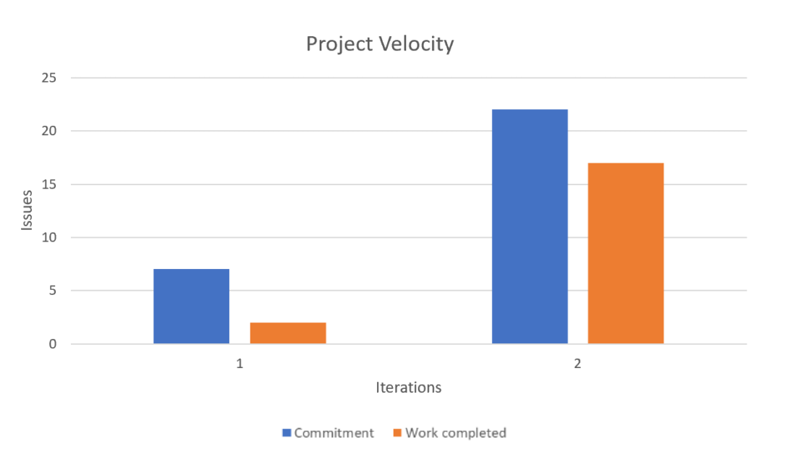

**Discuss a part of your project that has not been as successful as you would have liked, and how it can be improved in this iteration.**
**Determine concrete (and realistic) ways of improvement, and decide how its success will be evaluated at the end of the iteration (measurable and objective).**

For us as a team, we have determined that our time management was not as successful as we had liked. We came to the realization that when you're managing a large project with five people that even with good communication, it's hard to have a holistic view of what needs to be done and understand individual progress and capabilities of team members. We can improve this by thoroughly outlining what each team member is going to be working on and setting deadlines for what needs to be finished spanning throughout the iteration before the final due date. That way it's harder to procrastinate and push everything to the end where the amount of remaining work becomes overwhelming. We would have benefited from analyzing the information from the iteration description and rubric and make sure we're hitting the points described while simultaneously working on the project, instead of thoroughly looking through the rubric and description towards the end of the iteration. The guideline could’ve been used more as a checklist. To work on our time management as a team, our success at the end of the iteration will be determined by how many of our initial goals and commitments were we able to accomplish. We can measure this by looking at the ratio of features and user stories we were able to complete through the 3 iterations compared to the number of features and user stories that need to be pushed to the future iteration. 

Another factor to determine our success will be how well we were able to stick to the guidelines for our project. We can measure that by looking at the rubrics for our iterations and our grades and seeing what work we didn't complete based on the marks we lost. Both of these measurements are applicable to time management since if we have poor time management these are the things that will be left out, as we experienced during iteration 1 when we missed our ARCHITECTURE.md file because we only went through the rubric and description on the last day. This also occurred during iteration 1 and 2, when we didn't finish as many user stories and features as we had planned to due to lack of specific assignments of work across the team. 

A concrete way we can improve as a team, apart from time management, would be working on our smells and bugs before we start coding new features. Not doing so caused a lot of headaches since it only increased our merge conflicts which made merging our feature branches back into main more complicated than it had to be. We can determine the success of working on bugs and smells early by the amount of merge conflicts that we need to resolve pertaining to the fixing of those smells and bugs when we merge our feature branches. Another concrete way we can improve as a team, would be implementing dev tasks in our features and user stories. Doing so would allow us to visualize more easily what needs to be done to implement a feature or user story which would in turn allow us to complete more features and user stories by the end of the iteration. We can evaluate the success of adding dev tasks at the end of the iteration by comparing the features and user stories with dev tasks to the features and user stories with dev tasks which were completed in iteration 1 and iteration 2.

**Also include a chart (as an image) showing the 2 data points of project velocity from the last two iterations.**

